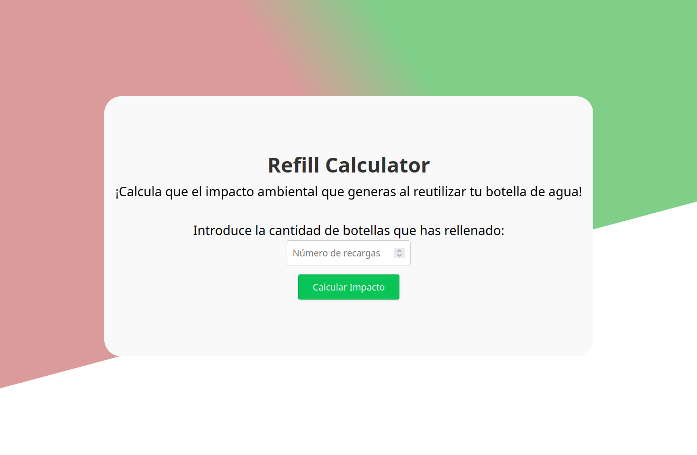
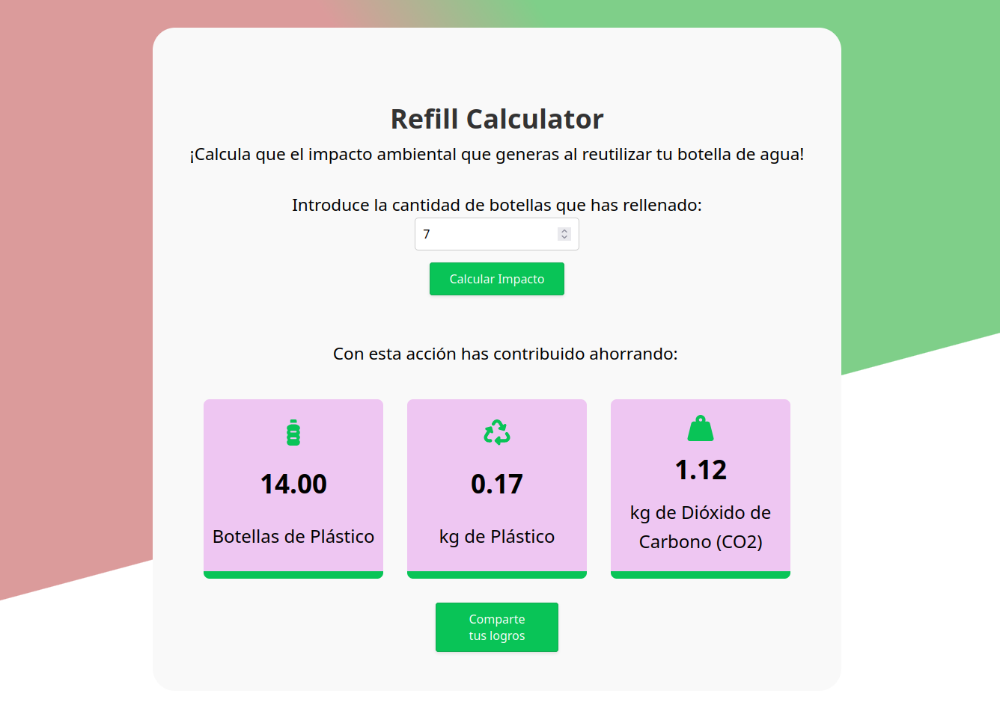

# Vue.js Water Refill Impact Calculator

## Project Overview

The Refill Impact Dashboard is a Vue.js application designed to calculate the environmental impact of using refillable water bottles. Users can input the number of water refills they have made, and the application calculates the amount of plastic bottles saved, kilograms of plastic saved, and kilograms of carbon dioxide saved.

## Screenshots

_Refill Impact Dashboard_



## Project Setup

### How to Run

To run the Refill Impact Dashboard locally, follow these steps:

1. Clone the repository:

```sh
git clone <repository-url>
```

2. Navigate to the project directory.
3. Install dependencies using:

```sh
npm install
```

4. Ensure Firebase is installed in your project using `npm install firebase`.

5. Ensure canvas-confetti is installed, simply run the following command in your terminal: `npm install --save canvas-confetti`

### Compile and Hot-Reload for Development

6. Run the development server with hot-reloading enabled using:

```sh
npm run dev
```

### Compile and Minify for Production

```sh
npm run build
```


## Visit the Web

You can visit the live version of the Refill Impact Dashboard [here](https://refill-impact-dashboard.web.app/).
